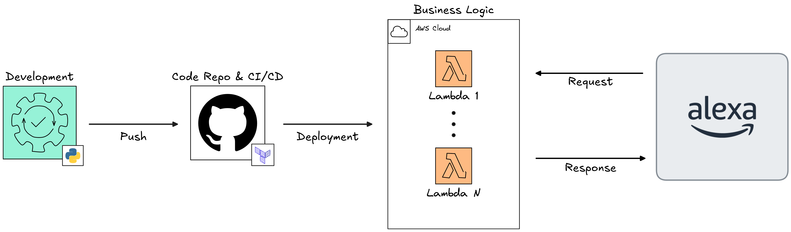

# Alervis

### Alexa + Jarvis: a programmable voice interface for AWS

**Alervis** is a personal voice-assistant project that uses **Amazon Alexa, AWS Lambda, and Terraform** to turn voice commands into programmable cloud actions.

Rather than building a traditional monolithic voice assistant, Alervis treats each capability as an independent Alexa Skill backed by its own Lambda function. This makes individual capabilities easy to develop, deploy, and expand independently.

> **Alexa → Skill → AWS Lambda → Custom Logic**

## Architecture

When an Alexa Skill is invoked, Alexa sends the request to its corresponding AWS Lambda function. The Lambda processes the request and returns an Alexa-compatible response.

Terraform manages the AWS infrastructure and provides a reusable configuration for deploying multiple Alexa/Lambda integrations.

Each skill is isolated as its own Lambda function, allowing Alervis to grow by adding new capabilities without creating a single large application.

## Current Capabilities

The repository currently contains several example skills demonstrating the core system:

- **Test Skill** - a basic end-to-end Alexa → Lambda integration used to verify that the system is working.
- **Google Health Test** - performs a network connectivity check from Lambda and reports the result through Alexa.

These examples serve as the foundation for expanding Alervis into a broader personal automation system.

## Project Structure

```text
alervis/
├── lambda/
│   └── skill_name/
│
└── terraform/
    ├── modules/
    │   └── alexa-skill/
    └── ...
```

The `lambda/` directory contains the individual Alexa Skill implementations, while `terraform/` contains the infrastructure required to deploy and connect those skills to AWS.

## Architecture


## Technology

- **Amazon Alexa**: voice interface and Skill platform
- **AWS Lambda**: serverless execution environment
- **Python**: skill implementation
- **Terraform**: infrastructure as code
- **GitHub Actions**: automated infrastructure deployment

## Project Status

Alervis is a work in progress and serves as a foundation for experimenting with voice-controlled automation, serverless applications, and AWS infrastructure.
